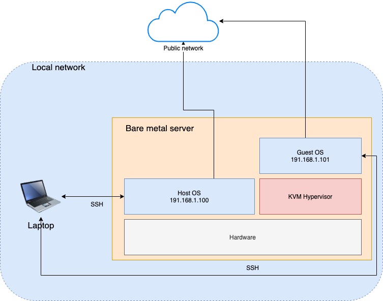
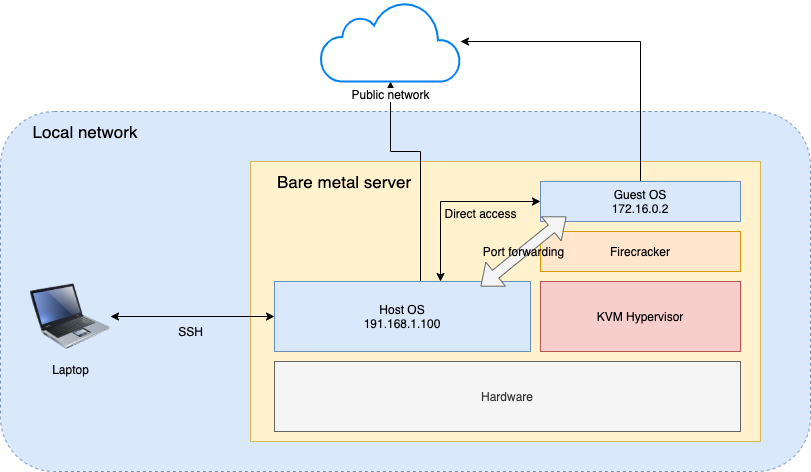
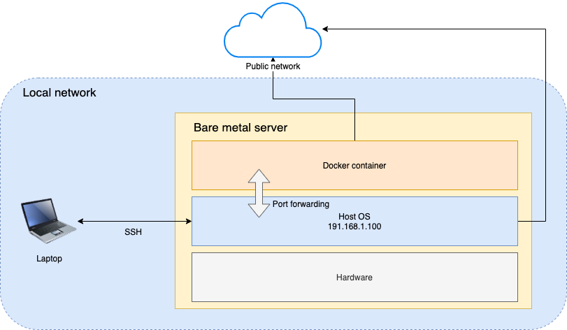

# platforms

This directory contains setup instructions for each platform, as well as general description of each platform from network perspective.

## Generic setup

The following diagram describes the setup in general. The "Server" in the diagram is the bare metal host used for the tests.

## KVM

The following diagram describes the specifics regarding KVM setup.

## Firecracker

The following diagram describes the specifics regarding Firecracker setup.

## Docker and gVisor

The following diagram describes the specifics regarding Docker (and gVisor) setup.

